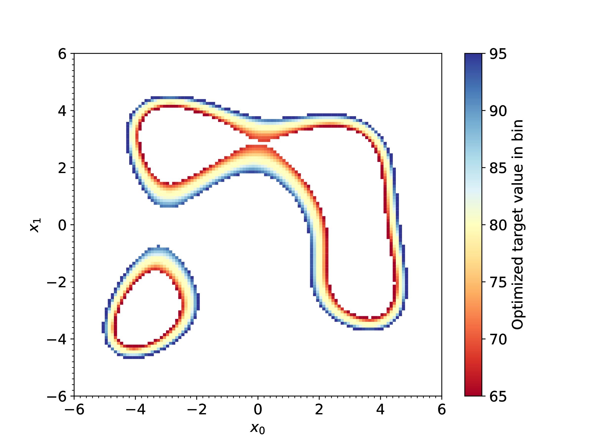
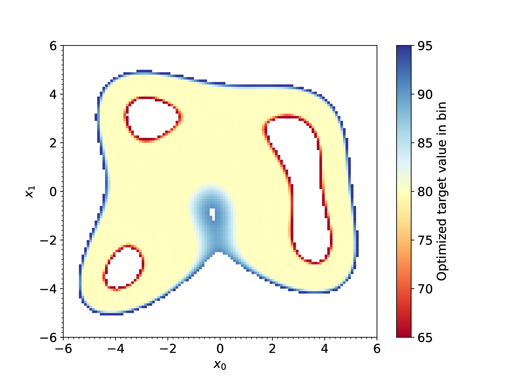

<br>
<div align="center">

</div>
<br>

# binminpy

A Python package for binned and parallelised sampling and optimisation.

Binminpy can be used in two different modes:
- [**Standard**](#standard-mode): Simple parallelized application of a chosen optimizer across a binned input space.
- [**Bottom-up**](#bottom-up-mode): A dynamic binning mode where the binning is built up gradually to only cover the input space of interest.
  - Within each bin the input parameters can either be sampled or optimized. 

See below for examples of both run modes.

# Installation

Simply install using `pip`:

```terminal
pip install git+https://github.com/anderkve/binminpy.git
```

# Standard mode

## Minimal example

Here is a minimal example of how to use binminpy to run `scipy.optimize.minimize` in parallel on a binned three-dimensional input space:

```python
import binminpy

# An example target function
def target_function(x):
    """A three-dimensional version of the Himmelblau function."""
    func = (   (x[0]**2 + x[1] - 11.)**2 + (x[0] + x[1]**2 - 7.)**2
             + (x[1]**2 + x[2] - 11.)**2 + (x[1] + x[2]**2 - 7.)**2 )
    return func

# Example binning setup for a 3D input space using 60x60x5 bins.
binning_tuples = [(-6.0, 6.0, 60), (-6.0, 6.0, 60), (-6.0, 6.0, 5)]

# Run binminpy.minimize, parallelized with four processes
# using multiprocessing.Pool (parallelization="mpp").
result = binminpy.minimize(
    target_function, 
    binning_tuples, 
    method="L-BFGS-B",
    tol=1e-9,
    return_evals=False,
    optima_comparison_rtol=1e-6, 
    optima_comparison_atol=1e-4,
    parallelization="mpp",
    max_processes=4,
)
```

## Parallelization

For the standard mode binminpy can be run with five different parallelization settings:

- **serial**: No parallelization.
- **MPP**: Distribute tasks evenly across multiple processes using `Pool` from `multiprocessing`.
- **PPE**: Distribute tasks evenly across multiple processes using `ProcessPoolExecutor` from `concurrent.futures`
- **MPI, even**: Distribute tasks evenly across MPI processes using `mpi4py`.
- **MPI, dynamic**: Use a master-worker pattern to distribute tasks across MPI processes using `mpi4py`.

## Available optimizers

The following optimizers are available through binminpy:

- [scipy.optimize.minimize](https://docs.scipy.org/doc/scipy/reference/generated/scipy.optimize.minimize.html#scipy.optimize.minimize)
- [scipy.optimize.differential_evolution](https://docs.scipy.org/doc/scipy/reference/generated/scipy.optimize.differential_evolution.html#scipy.optimize.differential_evolution)
- [scipy.optimize.basinhopping](https://docs.scipy.org/doc/scipy/reference/generated/scipy.optimize.basinhopping.html#scipy.optimize.basinhopping)
- [scipy.optimize.shgo](https://docs.scipy.org/doc/scipy/reference/generated/scipy.optimize.shgo.html#scipy.optimize.shgo)
- [scipy.optimize.dual_annealing](https://docs.scipy.org/doc/scipy/reference/generated/scipy.optimize.dual_annealing.html#scipy.optimize.dual_annealing)
- [scipy.optimize.direct](https://docs.scipy.org/doc/scipy/reference/generated/scipy.optimize.direct.html#scipy.optimize.direct)
- [iminuit.minimize](https://scikit-hep.org/iminuit/reference.html#scipy-like-interface)
- [Diver](https://github.com/diveropt/Diver)
  - Note: Diver should be built without MPI, to avoid interference with binminpy's parallelization.

Connecting a new optimizer to binminpy is easy:
- Add it as a new optimizer option in `binminpy/BinnedOptimizer.py`, where you specify how the optimizer should be called. (See the existing examples.) The optimizer result should be put into a `scipy.optimize.OptimizeResult` instance.
- Add an interface function in `binminpy/interface_functions.py`, following the same pattern as the existing functions.

*If you create an interface to a new optimizer that you think may be useful for others, you are very welcome to contribute it to binminpy via a pull request.*


## Examples with plots

### Example: binned optimization of a 3D Himmelblau function

In `example.py` binminpy is used to perform binned minimization of a 3D version of the Himmelblau function. The input space is binned using 60x60x5 bins. 
The output from binminpy is then used to make 1D and 2D plots showing the minimum function value for each given 1D/2D bin. 
The binminpy run is parallelized using `multiprocessing.Pool`. If you run this example you should get three plots looking like this:
  
 

 

### Example: masking parts of input space

The example in `example.py` also shows how to filter out uninteresting bins before starting the optimization, by passing a masking function to binminpy. 
For instance, when using the following masking function

```Python
def bin_masking(bin_centre, bin_edges):
    x0 = bin_centre[0]
    x1 = bin_centre[1]
    ellipse_1 = ((x0 - 0.0) / 4)**2 + ((x1 - 3.0) / 2)**2
    ellipse_2 = ((x0 + 3.5) / 2)**2 + ((x1 - 0.0) / 5)**2
    ellipse_3 = ((x0 - 3.5) / 2)**2 + ((x1 - 0.0) / 4)**2
    if (ellipse_1 > 1) and (ellipse_2 > 1) and (ellipse_3 > 1):
        return False
    return True
```

the results from `example.py` will look like this:

 

 


# Bottom-up mode

The main purpose of the bottom-up mode is to allow binned sampling/optimization limited to the regions of input parameter space that satisfy some user-defined criterion, while ignoring the rest of the input space. 

In the bottom-up mode binminpy works as follows:
1. A number of local optimization runs are performed, to identify all local optima.
  - In most applications the function optimized at this stage will be the main target fuction. But if the user wants to bin other parts of input space, they can instead provide a "guide function" — see example below for how this can be used to e.g. place bins along a contour of the original target function.
2. The input space is binned working outwards from the local optima.
  - For every bin that satisfies a user-defined threshold, the neighboring bins are added as new tasks for binminpy to explore.

The user decides which of the input parameters should be sampled and which should be optimized within each bin, and the methods used for sampling and optimization. Alternatively, the user can provide their own function that controls how parameter points are selected within each bin.

The bottom-up run mode is parallelized with MPI (`mpi4py`) through a master-worker pattern.

## Examples with plots

### Example: focus on regions close to the target function optima

In `example_bottomup.py` the bottom-up binning strategy is demonstrated on a three-parameter example: 
- The target function is a 2D Himmelblau function in `x[0]` and `x[1]`, with the third parameter `x[2]` representing a possible small shift/uncertainty in `x[1]`:
  ```python
  def target_function(x, *args):
      # """A 2D Himmelblau function in (x0,x1) with x2 representing a shift of x1"""
      func = (x[0]**2 + x[1] + x[2] - 11.)**2 + (x[0] + (x[1] + x[2])**2 - 7.)**2
      return func
  ```
- Binning:
  - `x[0]`: Range (-6.0, 6.0), divided into 120 bins
  - `x[1]`: Range (-6.0, 6.0), divided into 120 bins
  - `x[2]`: Range (-0.5, 0.5), divided into 2 bins
- All three parameters are optimized within each bin
- Criterion for adding neighboring bins: target value < 30

Running `mpiexec -np <N> python example_bottomup.py` with the number of processes (`N`) larger than 1 should produce a result similar to this:

 

This shows how the optimum regions of the Himmelblau function have been binned, and that the optimum regions are somewhat elongated in the `x[1]` direction due to the optimization over the shift parameter `x[2]`. 


### Example: focus on regions close to a target function contour

The example in `example_bottomup_contour.py` illustrates how the bottom-up mode can be used to sample/optimize a target function in the regions around a given contour value. The example works as follows:

- The target function is again a 2D Himmelblau function in `x[0]` and `x[1]`, but now the third parameter `x[2]` represents a scaling factor for the target function:
  ```python
  def target_function(x, *args):
      # """A 2D Himmelblau function in (x0,x1) with a scaling factor x2"""
      func = ((x[0]**2 + x[1] - 11.)**2 + (x[0] + x[1]**2 - 7.)**2) * x[2]
      return func
  ```
- To control how binminpy bins the input space there are two more user-defined functions, `guide_function` and `bin_check_function` supplied to binminpy:
  ```python
  def guide_function(x, y, *args):
      contour_chi2 = (y - 80.)**2 / 10**2
      return contour_chi2

  def bin_check_function(bin_result, x_points, y_points):
      bin_accepted = False
      guide_opt = bin_result.guide_fun
      if guide_opt < 1.0:
          bin_accepted = True
      return bin_accepted
  ```
  - The `guide_function` is a dummy chi^2 function that is minimized when the target function (the Himmelblau function) is close to y = 80, where "close to" is defined by the width (10 in the example above). 
  - The `bin_check_function` checks the optimized guide function within a given bin and accepts the bin if the guide function is < 1. For accepted bins, binminpy will add the neighboring bins as new tasks to do. 
- Binning:
  - `x[0]`: Range (-6.0, 6.0), divided into 120 bins
  - `x[1]`: Range (-6.0, 6.0), divided into 120 bins
  - `x[2]`: Range (0.99, 1.01), divided into 2 bins

Running `mpiexec -np <N> python example_bottomup_contour.py` with `N` > 1 should then give a plot like this of the (`x[0]`, `x[1]`) plane:

 

In each bin the target function value has been optimized over all three parameters according to the guide function, i.e. the colour shows the target value of that bin that is as close as possible to 80. We see that binminpy has only binned the parts of input space where the `check_bin_function` has allowed new bins to be added.

In the previous plot the scaling factor `x[2]` was only optimized over the small range (0.99, 1.01). If we instead increase this to the range (0.5, 2.0) the result will look like this: 

 


### Example: tailored parameter sampling

The bottom-up mode of binminpy can also be used to simply sample an input space such that samples are distributed across the regions the user regards as interesting. The example in `example_bottomup_contour_sampling.py` illstrates this. The example works as follows: 

- The target function is a standard 2D Himmelblau function in `x[0]` and `x[1]`:
  ```python
  def target_function(x, *args):
      # """A 2D Himmelblau function in (x0,x1) with a scaling factor x2"""
      func = ((x[0]**2 + x[1] - 11.)**2 + (x[0] + x[1]**2 - 7.)**2) * x[2]
      return func
  ```
- The `guide_function` and `bin_check_function` are identical to the example above, i.e. defined such that binminpy will only add bins in regions where the target function can be close to the value 80.
- This example uses a coarser binning than the previous examples:
  - `x[0]`: Range (-6.0, 6.0), divided into 30 bins
  - `x[1]`: Range (-6.0, 6.0), divided into 30 bins
- Latin hypercube sampling is used within each bin to sample ten (`x[0]`, `x[1]`) points.

Running `mpiexec -np <N> python example_bottomup_contour_sampling.py` with `N` > 1 should produce a scatter plot looking something like this:

 


# Citation

If you use binminpy in your work, make sure to also acknowledge the paper and/or repository for the optimizer you use.


# License

The license for the binminpy source code is GNU GPLv3 (see the [LICENSE](./LICENSE) file). However, if you use binminpy, make sure to adhere to the license of the optimizer you use.

